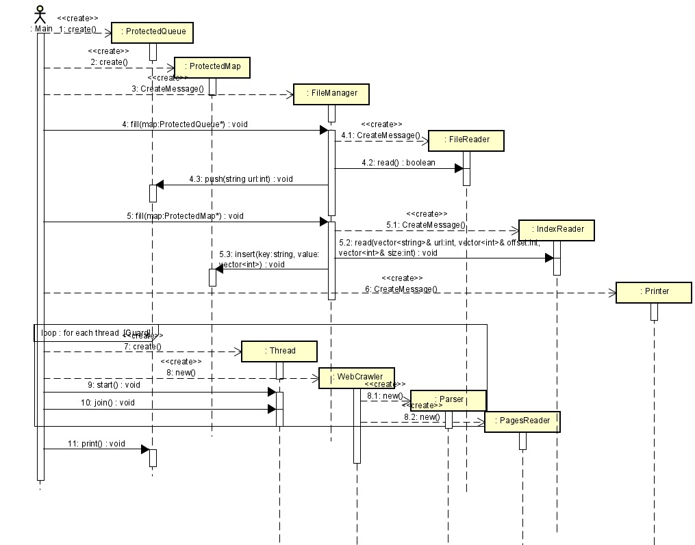

# Taller de Programación - Cátedra Veiga - FIUBA
# Trabajo Práctico II

<h2 align="right">Juan Bautista Xifro</h2>
<h2 align="right">101717</h2>

## Introducción
En este segundo trabajo practico se nos pide implementar un ```web crawler multi-threading``` en C++ utilizando POO y move semantics. Si bien el **web crawler** no busca en la web si lo simula mediante un archivo llamado ``` pages ```.

## Formato de línea de comandos
Por linea de comandos se ingresan los siguientes parámetros:
```target ``` archivo que contiene las URLs iniciales a escanear.
```allowed```dominio el cual las URLs escaneadas deben cumplir (salvo las que están dentro del archivo target).
```w``` cantidad de threads a invocar.
```index``` archivo que indexa al archivo pages.
```pages``` archivo para la emulación del fetch del web crawler.
```n``` cantidad de segundos que el thread main debe esperar antes de cerrar la queue.

## Diseño
El diseño consiste en una clase ```Thread``` que implementa un método run() abstracto que es redefinido por la clase ```WebCrawler``` el cual da inicio al escaneo del archivo  ```pages``` y gracias a los threads lo puede hacer concurrentemente.

<br><p align="center"></p>

Por su parte el ```WebCrawler``` da uso de una clase ```Parser``` destinada a la filtración de las URLs que no cumplan con el *allowedDomain*  y dos clases **thread safe** apodadas ```protected``` en mi caso ```ProtectedQueue``` y ```ProtectedMap``` las cuales poseen un atributo **mutex** para hacer que su comportamiento sea atómico desde la perspectiva de  los threads y ```ProtectedQueue``` además haces uso de otro parámetro de tipo **condition_variable** el cual hace que la queue sea bloqueante y cuando se pushea un nuevo url a la queue mediante este atributo se *"despierta"* a los demás threads para que reanuden su ejecución.

También se hace uso de ```PagesReader```, ```IndexReader```,
y ```FileReader``` clases destinadas a la lectura especifica de cada archivo.

Por ultimo ```ProtectedQueue``` da uso de una de ```SortIndices``` el cual permite ordenar los URLs para que se impriman por pantalla de forma ordenada de menor a mayor.

## Diagramas de secuencia
Diagrama de secuencia de la creación de los objetos partiendo de main.
<br><p align="center"></p>

Diagrama que muestra el comportamiento de un thread.

<br><p align="center"></p>

## Conclusión
Este tp me resulto complejo sobretodo la parte de la programación de los threads los cuales se comportan de forma muy distinta a la ejecución de los programas que venia programando hasta ahora. Me pareció muy interesante todo este concepto y estas nuevas herramientas.

## Corrección post entrega
En la corrección se me indico que ```ProtectedQueue``` y ```ProtectedMap``` cumplían mas funciones de las que deberían, por lo tanto decidí crear 2 nuevas clases una llamada ```FileManager``` la cual es la encargada de leer los archivos ```target``` e ```index``` para obtener los datos de ellos y luego introducirlos a la queue y al map respectivamente. Por ultimo agregue otra clase llamada ```Printer``` la cual se encarga de ir acumulando las URLs que se van leyendo para luego poder imprimirlas ordenadamente como indica el enunciado. Con estas clases saco responsabilidades al ```ProtectedMap``` y al ```ProtectedQueue``` cumpliendo con TDA y encapsulamiento.

También se me indico que estaba usando demasiado el *heap* hice correcciones al respecto y ahora aloco todo en el stack. Me quedo un solo caso donde aloco en el heap.

```
    std::vector<std::string> container_state;
    std::vector<std::string> container_url;
    for (auto &url : this->container){
        container_url.push_back(url.getUrl());
        container_state.push_back(url.getState());
    }
    const int indices_count = container_url.size();
    int* indices = new int[indices_count]; 
    int i = 0;
    for (; i < indices_count; i++){
        indices[i] = i;
    }
    std::sort(indices, indices + i, SortIndices(container_url));
    for (int indice = 0; indice < indices_count; indice++){
        std::cout << container_url.at(indices[indice]) << " -> "
                 << container_state.at(indices[indice]) << std::endl;
    }
    delete[] indices;

```

Justifico este uso del heap ya que estoy creando un vector de *int* el cual no conozco su tamaño, mi variable *indices_count* depende de la cantidad de URLs que el web crawler haya encontrado, es por esto que aloco memoria en el heap ya que no conozco un posible maximo.

Por ultimo el deadlock fue arreglado ya que cuando el thread main *despierta* ahora no solo coloca el atomic boolean en verdadero sino que también llama a una función de la queue que *despierta* al thread que estaba en la condition variable y coloqué mas condiciones que hacen salir del loop a los threads si main ya *despertó*.
